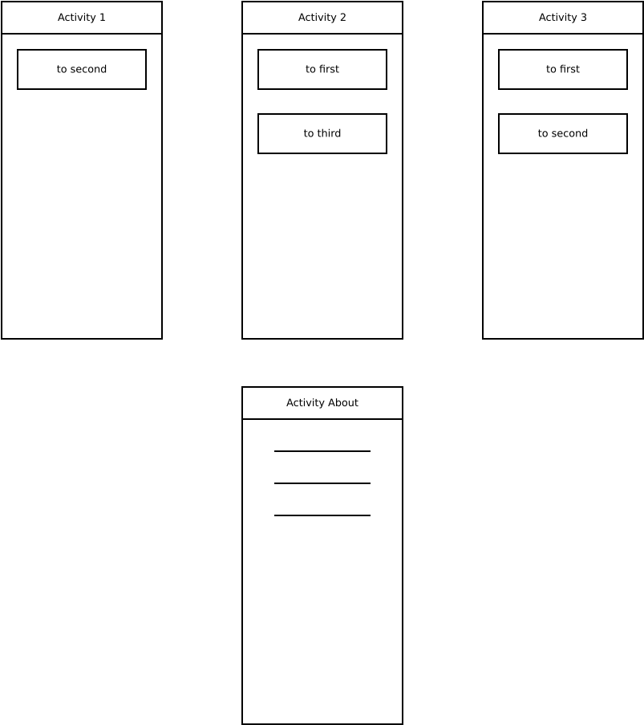

# Введение
В данной лабораторной работе предлагалось 
* Ознакомиться с Lifecycle-Aware Components на примере с codelab;
* Изучить основные возможности навигации между Activities и Fragments.

# Задание №1

В данном задании предлагалось ознакомиться Lifecycle-Aware Components на готовом примере с
codelabs. 

На 1 шаге (1 Activity) предлагалось рассмотреть простой секундрмер, основанный на классе
`Chronometer`. При его тестировании выяснилось, что он:
- продолжает подсчет секунд в свернутом состоянии;
- обнуляется при повороте экрана.

На 2м шаге исправляется обнуление секундомера при повороте с помощью класса `ChronometerViewModel`, 
наследуемого от класса `ViewModel`. В данном классе будет храниться время, с которого начался
отсчет, и это же значение будет впоследствии использоваться при создании новой Activity. Наш
`ViewModel` будет жив ровно столько же, сколько будет жив `LifecycleOwner` (this), а потому, пока
мы не выключим приложение или систему, с хранением значения проблем возникнуть не должно. Проверяем
секундомер, переключаясь на другое приложение, переворачивая в нем экран, и затем возвращаясь
обратно.

На 3м шаге вместо того, чтобы постоянно обновлять таймер на экране,ссылаясь на `Chronometer`,
сам UI будет обновляться в зависимости от `Timer`, который обновляется раз в секунду. Таким образом
мы сэкономим для нашей Activity больше ресурсов для взаимодействия пользователя с UI. В нашем классе
`ViewModel` логика остается та же: хранится время отсчета, от которого считаем, сколько времени
прошло. Единственным отличием является то, что в этом же `ViewModel` и производится подсчет, который
будет храниться в экземпляре класса `LiveData`. Это лучше, чем хранить данные в примитивах, т.к.
данный класс уведомляет об изменении своего значения, инициируя в этот момент указанное в методе
`observer` действие. При этом он не будет уведомлять, не активное Activity, а потому UI не будет
меняться, если свернуть приложение.

На 4м шаге рассматривается возможность при помощи класса `LifecycleObserver` подписки объектов
наследника на изменения состояния lifecycle owner, а также рассматривается аналогия с аннотацией
`@OnLifecycleEvent`.

На 5м шаге синхронизация между фрагментами была реализована при помощи `ViewModel`, который
находится в области видимости родительского Activity. Послучают фрагменты этот `ViewModel` от
родителя при помощи метода `activityViewModels`.

На 6м шаге рассматривалась программа реализовать сохранение локальных данных при остановке
приложения (освобождение памяти). Реализовано это при помощи модуля lifecycle-viewmodel-savedstate с
классом `SavedStateHandle` для использования в `ViewModel`.

# Задание №2

В данном задании нужно было реализовать переход между Activity (при чем в backstack не должно
находиться больше 4 Activity).

*Рис. 1. Задание*

Запустить ActivivityAbout можно из любой другой Activity при помощи Option Menu внутри кастомного
Toolbar.

Остальные Activity запускаются при помощи определенных кнопок в соответствии с рис. Чтобы избежать
переполнения backstack:

1. по возможности не начинать новую Activity, а завершать текущую методом `finish`, передавая
управление верхней в backstack Activity;
2. вызывать некоторые Activity будем при помощи метода `startActivityForResult`.

Так для того, чтобы из Activity2 попасть в Activity1, достаточно завершить эту Activity (Activity1 в
этот момент будет верхней в этот момент).

При помощи класса Intent (используется для передачи информации между Activity) и метода `setResult`
передавать определенную информацию при старте и завершении Activity. В данном случае при
нажатии кнопки в Activity3, она будет завершаться и передавать управление Activity 2, но в
зависимости от кнопки будет подаваться сигнал (при помощи методов setExtra и putExtra), нужно ли
также завершить Activity2 (переход в Activity1) или нет.

# Задание №3

Вместо того, чтобы использовать методы `startActivityForResult` и `setResult`, можно использовать
Intent-флаги.

`Activity1` оставим без изменений.

В `Activity3` была реализована логика возвращения результата (чтобы открыть нужную Activity), и
поскольку мы отказались от методов с результатами, для перехода на `Activity2` достаточно оставить
метод `finish`, а для перехода на `Activity1` будем запускать новую Activity, указывая `Intent`
добавить флаг `FLAG_ACTIVITY_CLEAR_TOP`. Благодаря этому флагу, если эта Activity уже есть в
backstack, она будет перезапущена, уничтожая при этом все Activity в backstack выше нее.

Теперь в `Activity2` можно убрать лишнюю логику обработки результатов и оставить только `finish` и
`startActivity` для сооьветствующих кнопок.

Очевидно такой код гораздо короче.

# Задание №4

Для демонстрации используем Intent-флаг `FLAG_ACTIVITY_NO_HISTORY`.

Данный флаг указывает не сохранять запускаемую Activity в backstack.

Для примера, в `Activity1` создадим 2ю кнопку: 1я запускала `Activity2` без флага, а 2я будет
запускать ее с флагом.

Рассмотрим следующую последовательность действий:

1. Запуск придожения
2. Нажатие на 2ю кнопку (запуск `Activity2` с флагом)
3. Запуск `Activity3` (или `ActivityAbout`)
4. Нажатие кнопки "Назад"

После последнего действия, вместо `Activity2` откроется `Activity1`, так как при нажатии кнопки
"Назад" мы обратились к backstack, и, так как Activity2 в нем не сохранилась, самой верхней будет
`Activity1`.

# Задание №5

Вданном задании требуется заменить всю предыдущую логику запуска и завершения Activities на паттерн
Navigatinon graph с использованием одной Activity (+ по заданию должна быть отдельно ActivityAbout
вне графа) и нескольх `Fragment`.

Следуя документации, были заменены все 3 Activity на Fragment, была создана отдельная Activity, в
которой устанавливаются Toolbar и контейнер для Fragment. В самих Fragment осталась реализация
управления кнопками (отличие в том, что теперь навигация между фрагментами, а не Activities, и
осуществляется при помощи комбинациии методов `findNavController` (поиск `NavController` связанного
с кнопкой) и `navigate`.

Сама навигация описана в соответствующем ресурсе `navigation` (описаны все связи между фрагментами).

Данный паттерн весьма удобен в работе и, что более важно, он более оптимизирован.

# Вывод

В данной лабораторной работе ознакомился с Lifecycle-aware components на примере нескольких программ,
реализующие разные (более или менее оптимальные) способы хранения и обновления данных в зависимости
от Lifecycle указанных объектов. Также ознакомились с несколькими способами навигации между
несколькими экранами одного приложения:
1. с помощью методов `startActivity`, `startActivityForResult`, `setResult`, `onActivityResult`,
`finish`;
2. с помощью Intent-флагов;
3. с помощью паттерна Navigation.