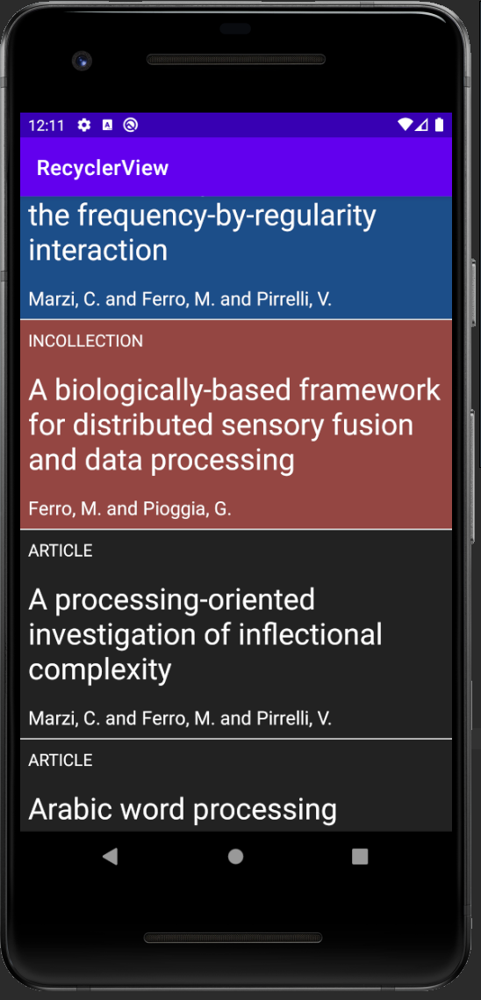

# Введение
В данной лабораторной работе предлагалось 
* Вспомнить Unit-тесты на примере библиотеки biblib (попутно изучив ее функционал;
* Изучить основные возможности RecyclerView.

# Задание №1

В данном задании была дана библиотека biblib, работающая поверх фреймворка bibtex, т.е. она
использует уже существующие функции. Отличием являются 2 флага для разных режимов работы:
- `strict` -- переключение из нормальнго режима в режим strict (при доставании типа или определенного
поля по ключу, при помощи индекса идет проверка, "инвлидейтнулся" ли уже данный объект или нет);
- `shuffle` -- позволяет перемешать объекты в случайном порядке

Далее были написаны тесты для проверки этих флагов.

Начнем со `strict`. Для нормального режима уже был составлен тест (при индексе большем, чем поле
из конфига `maxValid`, не проходит проверка, а значит не выкидывается никаких исключений). Тест со
`strict` режимом практически идентичен, отличие в том, что на следующем же индексе, большем, чем
`maxValid`, выкидывается нужный нам `IllegalStateException`.

В `shuffle` режиме все просто: из одного входного потока создаются 2 `BibDatabase` (обычный и с
включенным режимом `shuffle`) и сравниваются объекты (тест не проходит, если все объекты идентичны).

# Задание №2

С использованием библиотеки из 1 задания, нужно создать android-приложение, который выводит
информацию из файла `.bib` в список при помощи утилиты `RecyclerView`.

В основном layout располагается только блок `RecyclerView`. Также был заранее создан отлельный
layout для одного "айтема" в нашем `RecyclerView`.

В программной части были созданы `RecyclerViewAdapter` и `ViewHolder`. Адаптер принимает входной
поток и его помощью создает новый `BibDatabase`. Определены методы `getItemCount` (размерность
 БД) и `onCreateViewHolder` (привязывание при помощи ViewBinding, теперь к "лэйауту айтема" можно
 обращаться при помощи `ViewHolder`). В переопределенном методе `onBindViewHolder` определяется
 содержимое текстовых полей (формат объекта, название и автор), при этом от формата зависит цвет
 фона "айтема".

*Рис. 1. Пример работы приложения*

# Задание №3

В данном задании нужно модифицировать адаптер, сделав прокручиваемый список бесконечным (при индексе
`lastIndex + 1` список пойдет по новому кругу и так до бесконечности).

Ранее в адаптере в методе `onBindViewHolder` "вхождение" доставалось следующим образом:
`database.getEntry(position)`. Достаточно лишь при переопределить индекс `currentPosition = position
 % database.size()`, и таким образом мы получим бесконечный список.

# Вывод

В данной лабораторной работе вспомнил о составлении обычных unit-тестов в kotlin. Также ознакомился
с основными принципами работы `RecyclerView`, создав кастомный адаптер для определенного набора
данных, а затем модифицировал этот список в бесконечный.

`RecyclerView` является оптимальной заменой устаревшим `ListView` и `GridView` по нескольким
причинам:

1. Обязательное наличие `ViewHolder` (в том же `ListView` он не обязателен), т.е. поиск нужного
элемента в xml (который может быть весьма громоздким) по id будет производиться всего 1 раз в самом
начале; кроме того такая благодаря `ViewHolder` можно устанавливать различные настройки для разных
типов айтемов (например задавать разные Listeners, аттрибуты типа цветов и т.п.);
2. Компановкой айтемов занимается 'LayoutManager' (один элемент `RecyclerView` может выступать в
качестве сетки, плитки элементов или кастомной визуализации списка, так как за это теперь отвечает
отдельный класс);
3. Код адаптера получается более компактным, так как большинство методов, переопределяемых ранее в
 адаптерах `ListView` и `GridView`, реализованы за нас;
4. Айтемы в `RecyclerView` можно кастомизировать визуально еще больше при помощи `ItemDecoration` и
`ItemAnimator`, но в рамках данной работы ими не воспользовался, так что подробнее о них рассказать
покаа не могу.

Кроме того не стоит забывать и о главном преимуществе, которое было и в legacy `ListView` и
`GridView`, а именно динамическое отображение массива данных (они устроены таким образом, что в
реально существуют Views столько, сколько помещается в layout + несколько в запасе до и после
списка ViewGroup).
