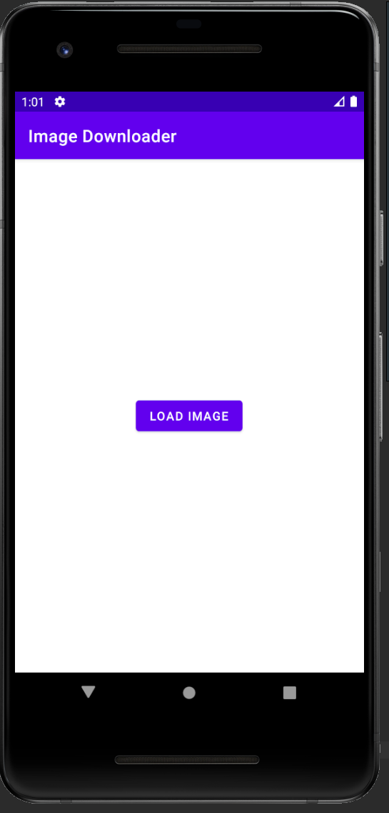
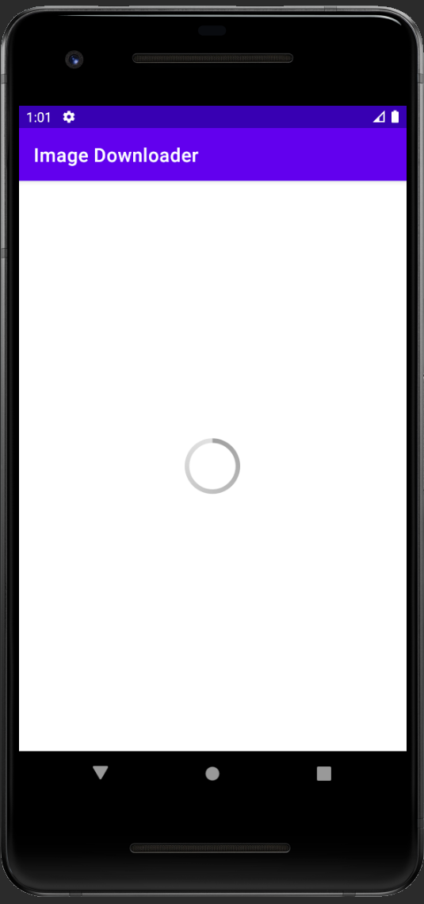

# Введение
В данной лабораторной работе предлагалось 
* ознакомиться с основами многопоточных android-приложений.

# Задание №1

Реализованное во 2 работе приложение continuewatch теперь нужно реализовать 3 способами:

1. при помощи `Thread`;
2. при помощи `AsyncTask`;
3. при помощи coroutines.

Изначально приложение и было реализовано при помощи 2х `Thread` (один отвечал за обновление UI, а
другой – собственно секундомер), по этому 1й пункт можно спокойно пропустить.

Далее приложение было реализовано при помощи класса `AsyncTask`. В отличии от `Thread`, `AsyncTask`
оптимизирован специально под android-приложения, поэтому нам больше не нужно задумываться о
завершении или остановке потоков при перемещении приложения по его жизненному циклу. Остальной
функционал реализован при помощи 2 переопределенных методов:

1. `doInBackground`: выполняет фоновые выисления в своем потоке; в моем случае единственное, что он
делает -- усыпляет поток на 1 секунду, после чего вызывает метод `publishProgress`, который в свою
очередь вызывает метод `onProgressUpdate`;

2. `onProgressUpdate`: выполняет действия с UI в отдельном потоке; в моей реализации менйятся
textView и инкрементируется счетчик.

Данный метод гораздо лучше подходит под данную задачу, так как он позволяет более корректно
использовать фоновый и UI потоки. и это не говоря о том, что код получился более прочтым и коротким.

В конце также была сделана реализация на Coroutines. В данном случае я реализовал все через
`lifecycleScope`, который за нас определяет, на каких этапах запускаться корутина. В остальном
все осталось также, как и в `AsyncTask`: в контексте основного-потока `Default` выполняется задержка
 на 1 секунду, в контексте UI-потока `Main` идетобновление UI + инкрементация счетчика.

В теории корутины гораздо более эффективны в плане производительности, чем `AsyncTask`, так как
используют облегченные потоки.

# Задание №2

Данное задание не сильно отличается от 2го пункта 1го задания. Разве что теперь AsyncTask не
цикличен.

Само приложение имеет кнопку, которая начинает загрузку картинки, становясь в этот момент невидимой,
а также `ProgressBar` и `ImageView` (изначально невидимые).

Здесь не будет переопределяться метод `onProgressUpdate`, а метод `doInBackground` теперь
возвращает экземпляр класса `Bitmap`, который хранит наше изображение и который передается в
метод `onPostExecute`. Последний будет управлять видимостью `ProgressBar` (он кстати появляется
при нажатии кнопки) и `ImageView`, а в последнюю еще и поместит полученное изображение.

# Задание №3

Здесь все тоже самое, но только с использованием корутин, а не `AsyncTask`. Единственное, что могу
добавить, так как загрузка картинки происходит через `InputStream`, то загрузка происходит в
контексте IO-потока.

# Задание №4

Данное задание позволяет ознакомиться с готовыми библиотеками для загрузки изображений. Мною была
выбрана библиотека Picasso. Данная библиотека использует `Executor` для реализации своей
многопоточности. В целом порядок работы очень простой:

1. Обращаемся к статическому методу `get` для получения Экземпляра;

2. У экзмепляра вызываем метод `load` (в нем указываем ссылку на изображение);

3. При помощи метода `into` одновременно указываем наш ImageView для полученной картинки, а также
объект наследуемый от библиотечного интерфейса `Callback`, в котором реализуем 2 функции: на случай
успешной загрузки (`ImageView` делаем его видимым, а `ProgressBar` невидимым) и на
случай ошибки (просто выводим ее).

Получилось очень удобно, но вплане эффектиной производительности библиотека выбрана не очень удачно,
т.к. по сути работает с Java Threads, которые неэффективны посранению с Kotlin Coroutines.

Учитывая, что остальные предложенные в задании библиотеки тоже используют не Kotlin Coroutines,
я решил сделать тоже самое, но с использованием библиотеки Coil, которая корутины использует в
качестве основного инструмента для организации многопоточности. Работает схоже с Picasso: теперь
обращаемся не к отдельному классу библиотеки, а к самому `ImageView`, вызываемый метод load,
выступающий в качестве расширения от библиотеки, в нем указываем адрес, а также лямбду, в которой
создаем экземпляр класса `Listener` для определений действий на случаи успеха загрузки и ошибки.

# Вывод

В данной работе получил основные знания о многопоточных android-приложений. С классом `Threads` был
знаком и до этого. Ознакомился с классом `AsyncTask`, который более корректно работает с
android-потоками, а значит в данном случае это более оптимальный вариант посравнению с Java Threads.
На практике подкрепил теоретические знания о Kotlin-Coroutines, которые являются облегченной версией
 Java Threads. На практике, правда, не удалось сравнить производительность всех реализаций, но
зато оценил простоту реализацию кода на `AsyncTask` и Coroutines, так как оба имеют оптимизацию под
android.

Кроме того научился загружать изображения 2мя способами: вручную при помощи стримов и при помощи
библиотеки Picasso. Библиотека имеет множество фич, а библиотека Coil к тому же использвует
корутины, а не Java Threads, так что во всех отношениях, ее использовать гораздо благоразумнее,
чем пытаться написать что-то самому похожее, да и вместо других библиотек тоже разумно использовать
(имеет такой же функционал + есть совместимость с библиотеками, что предложены в задании).
