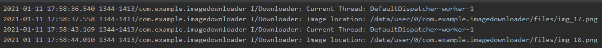
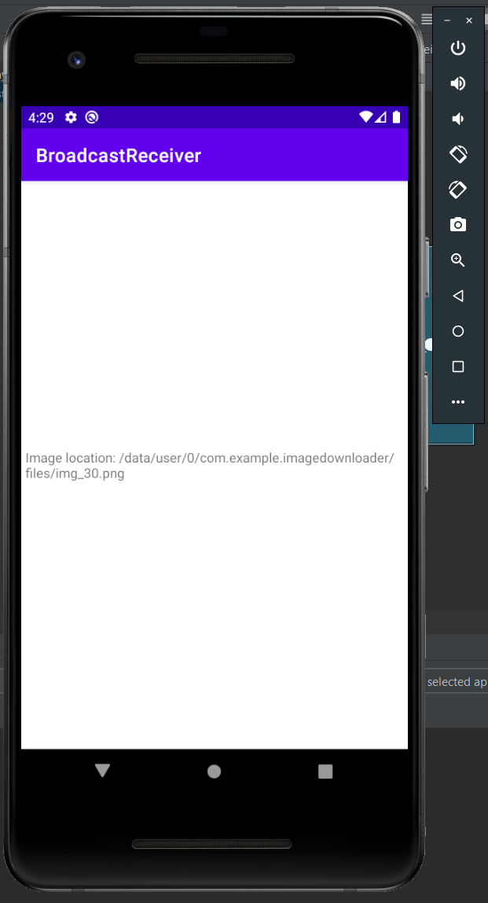
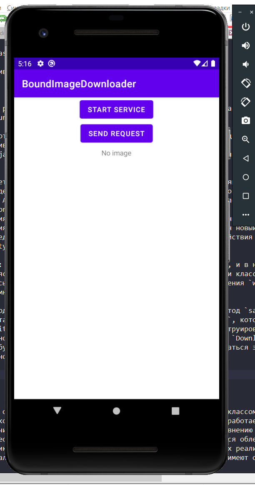
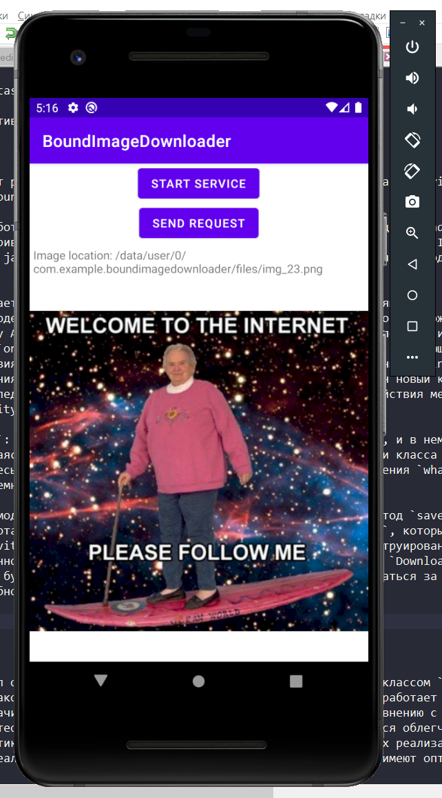
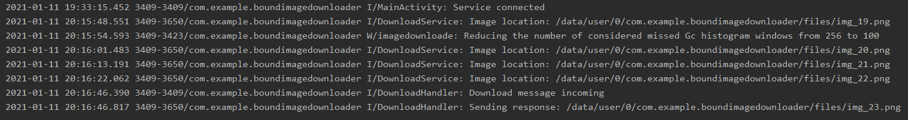

# Введение
В данной лабораторной работе предлагалось 
* ознакомиться с сервисами и Broadcast receiver в android-приложениях

# Задание №1

Для создания сервиса был создан класс, наследуемый от класса `Service`. Обязательно нужно 
переопределить метод `onBind`, но до 3 задания он нам не нужен (в данном задании требуется создать 
started сервис), поэтому переопределим его так, чтобы он возвращал `null`. 

Куда важенее переопределить метод `onStartCommand`. Этот метод и будет реализовывать наш 
started seкvice. С помощью входного аргумента класса `Intent` (передается методом `startService`, 
который вызывается из `MainActivity`). В моем случае в `Intent` заносится url изображения.
Далее через корутину в IO-потоке (узнать текущий поток можно при помощи `Thread.currentThread()`) 
загружается изображение и отправляет локацию загруженного изображения широковещательным сообщением 
(об этом подробнее во 2 задании). В конце сервис обязан завершить самого себя чтобы не занимать 
системные ресурсы, а также вернуть некую константу, соответствующую нашим пожеланиям по поводу 
перезапуска сервиса (я возвращаю константу `START_NOT_STICKY`, т.к. мне перезапуск не нужен).

Рис. 1. Результат работы приложения.

По каждому клику по кнопке в Logcat выводятся название потока, в котором выполняется корутина и 
локация загруженного изображения.

# Задание №2

Было создано отдельное приложение, с классом `DownloadReceiver`, наследующийся от 
`BroadcastReceiver`. Данный класс с помощью `IntentFilter` и метода `registerReceiver` будет
обрабатывать определенные широковещательные сообщения, отправляемые например из приложения, 
реализованного в прошлом задании, а именно запускать новую Activity с текстовым полем, содержимое
которого является содержимое бродкаст-сообщения (в бродкасте будет содержаться местоположение 
изображение, загруженное `DownloadService`.)

Рис. 2. Activity, запстившаяся после нажатия кнопки в предыдущем приложении.

# Задание №3

Данное приложение может работать аналогично тому, что и в 1 задании (кнопка Start Service), т.е. 
запускать Started (Unbound) Service.

Кнопка Send Request работает иначе. У `DownloadService` был переопределен метод `onBind` и теперь 
можно нашу Activity "привязать" к сервису. Как и в случае со Started создается новый `Intent`, в 
который также подается java-класс сервиса, а затем данный `Intent` используется в методе 
`bindService`. 

Кроме того туда же подается объект наследуемый от `ServiceConnection`, мониторящий 
состояние сервиса, и содержащий переменную класса `Messenger`, благодаря которой возможен будет 
обмен информацией между Activity и сервисом. Конкретно этот `Messenger` будет получен из метода
результата выполнения `onBind`. Из метода мы получим экземпляр класса `IBinder`, являющийся 
итерфейсом взаимодействия внутрипроцессных и межпроцессных взаимодействий. Данный `IBinder` 
получается путем создания нового `Messenger`, в конструкторе которого был подан новый класс 
`DownloadHandler`, наследуемый от `Handler`, который нужен для описания взаимойствия между 
сервисом и нашей Activity. 

Возвращаясь к `IBinder`: из него `ServiceConnection` снова сделает `Messenger`, и в нем же он 
будет храниться. Обращаясь к этому `Messenger` в дальнейшем мы будем при помощи класса `Message` 
(содержит поле для пересылаемой информации `obj`, поле для идентефикации сообщения `what` и поле 
`replyTo`, о котором немного позже).

`DownloadHandler` взаимодействуя с сервисом запускает загрузку изображения (метод `saveImage`). 
Однако на этом его работа не заканчивается, и далее он обращается к `Messenger`, который мы 
заранее создали в Activity и поместили в `replyTo`. Этот `Messenger` был сконструирован на основе 
`ResponseHandler`, именно на этот `Messenger` будет слаться новое сообщение из `DownloadHandler`, 
и в `Handler` которого будет вестись взаимодействие с Activity (он будет обращаться за 
`ViewBinding`, чтобы обновить текстовое поле и изображение).

Рис. 3, 4. Результат нажатия 2 кнопки.

Рис. 5. Logcat.

# Вывод

В данной работе получил основные навыки работы с Сервисами в Android-приложениях (работа с классом 
`Service`) и работы с отпракой и обработкой Broadcast-сообщений (класс `DownloadReceiver`).

По поводу сервисов: на практике изучил 2 основные модели сервисов – started (совершают некоторые 
действия в background, которые явно пользователю не отображаются) и bounded (предполагает некоторое 
взаимодействие с компонентами типа Activity, и может реализовать клиент-серверное взаимодействие).
Для последнего также были получены навки работы с классами `Messenger`, `Handler` и `Message`.